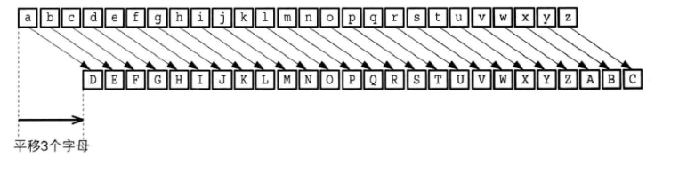
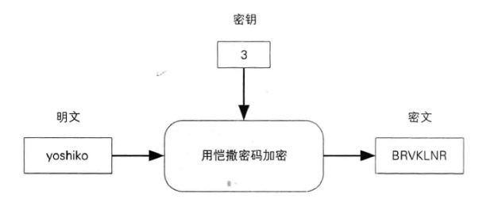
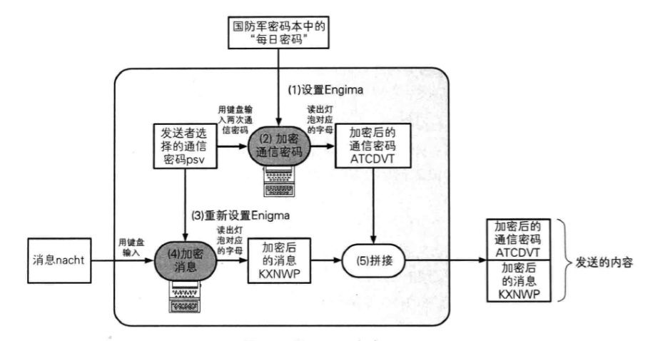
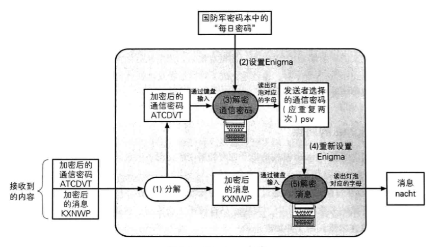

# 密码学简史

## 凯撒密码（Caesar cipher）

> 凯撒密码的加密：通过将明文中所使用的字母表按照一定的字数"平移"来进行加密
> 用凯撒密码进行加密，密钥为3





`简单示例`
```python
def caesar_cipher(sentence, step=3):
    return ''.join([chr(ord(c) + (step)) if c != ' ' else ' ' for c in sentence])

ciphertext = caesar_cipher('Hello Caesar cipher')
print(ciphertext)
```

## 简单替换密码

> 将26个字母，每一个字母对应另一个字母，这样任意一种对应就是一个新的密码

## 暴力破解

> 遍历所有结果去查找答案

## 频率分析

> 简单替换密码替换的密钥空间有 26!
> 这个时候使用 暴力破解就不太高效了，时间会非常非常长，无法实行

`频率分析统计密文中的字母出现的频率，然后去找日常使用的明文的字母使用频率，就可以找出一些规律来`


## Enigma (二战德国使用)
> 德国人 发明的能进行加密和解密的机器
> 最初用于商业，后德国纳粹时期，国防军将其改良用于军事用途

### 使用 Enigma进行加密通信

- 发送者和接受者事先会收到一份叫`国防军密码本`的册子;里面记录了发送者和接收者的每日密码




### 避免通信错误

- 在Enigma那个时代，无线电质量太差，接收者可以在收到通信密码的时候进行校验是否是3个重复两次的形式


### Enigma 解密



### Enigma的弱点

- 将通信密码连续输入两次并加密
- 通信密码是人为选定 (很有可能会选简单的密码如 aaa bbb 这样的)
- 必须派发国防军密码本 (如果落到敌人手里，那又要重新制作一套密码本)

### Enigma 的破解
- 波兰密码破译专家，得到法国提供的信息支援，提出了通过通过密文找每日密码的方法
- 后来由于担心德国进攻波兰，波兰决定将这些情报提供给英国和法国;不久后，二战就全面爆发了
- 英国的密码破译专家中就有 现代计算机支付 `阿兰.图灵`, 他根据提供的情报继续研究，终于在1940年研制出破译 Enigma的机器

